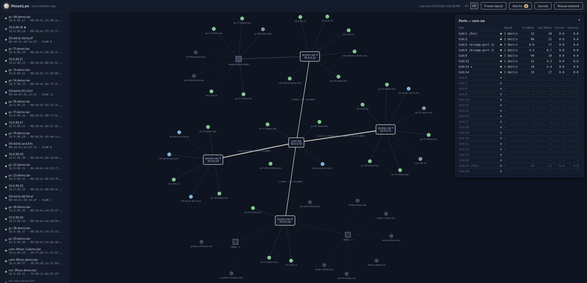
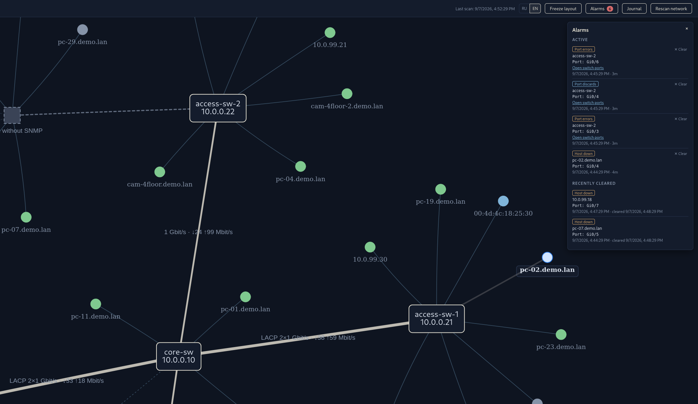

[Read in English → README.md](README.md)

# MoonLan

**MoonLan** — веб-сервис для Linux, который автоматически строит физическую
топологию локальной сети на основе данных, полученных с коммутаторов по
протоколу SNMP, и отображает её в браузере.

Открытый аналог LanTopoLog. Лицензия — MIT.



*Автоматически обнаруженная топология: агрегированные каналы LACP, неуправляемые коммутаторы, группы отключенных устройств и счетчики активности портов в реальном времени.*



*Панель тревог: ошибки портов, отброшенные пакеты и сбои в работе хостов с возможностью перехода к таблице портов коммутатора в один клик.*

## Возможности (v0.6.3)

- Опрос коммутаторов по SNMP v2c: имя устройства, порты, скорости, статусы.
- Чтение таблиц MAC-адресов (BRIDGE-MIB и Q-BRIDGE-MIB) с каждого
  коммутатора, включая записи на транковых bridge-портах, отсутствующих
  в `dot1dBasePortIfIndex` (например, LACP-транки D-Link).
- Корректное построение топологии: связь между коммутаторами рисуется,
  только если она прямая (критерий пересечения FDB) — в звезде нет ложных
  связей между лучами. Коммутатор опознаётся в чужих FDB по полному набору
  своих MAC (базовый MAC моста, MAC интерфейсов, MAC management-IP);
  при односторонней видимости работает запасное правило исключения.
  В карточке связи — порты обеих сторон.
- Стабильность связей: FDB объединяется за последние 3 опроса, поэтому
  связи не «мигают» при старении MAC-таблиц.
- LACP (IEEE8023-LAG-MIB): агрегат отображается одной толстой линией
  с подписью «LACP N×скорость» и составом агрегата в карточке связи.
- VLAN (Q-BRIDGE-MIB): PVID порта каждого хоста и имена VLAN —
  в карточке хоста и в списке устройств.
- Обнаружение неуправляемых коммутаторов: если за портом видно много
  хостов, они группируются под узлом «Коммутатор без SNMP»
  (порог `unmanaged_threshold` в конфигурации).
- IP-адреса хостов из ARP-таблиц маршрутизаторов (раздел `routers`
  в конфигурации), имена — через обратный DNS. IP принадлежит ровно
  одному MAC, поэтому заменённое устройство или переназначенный DHCP
  адрес не остаются второй записью хоста.
- Устойчивый инвентарь: хост, чей MAC пропал из таблиц коммутаторов,
  остаётся на карте на своём последнем порту в течение
  `host_grace_hours` (по умолчанию 24), приглушённым и с отметкой
  «Последний раз виден …», а не мигает при каждом старении MAC-таблицы.
  Устройства, известные по ARP, но не найденные ни на одном порту
  (например, подсеть за маршрутизатором), собраны в разделе «Вне
  карты» — по ним работают поиск и ping. Отчёт о полноте инвентаря и
  о том, каких подсетей не хватает: `python -m moonlan.diag --hosts`.
- Читаемая карта любого размера: офлайн-устройства одного порта
  собираются под узлом «Офлайн · N», а не превращаются в облако серых
  точек вокруг каждого коммутатора (`offline_group_threshold`); сами
  устройства остаются видны за узлом группы, а в её карточке — список
  с временем последнего появления. Подпись выделенного узла получает
  скруглённую подложку и читается поверх рёбер и соседей, а раскладку
  можно остановить кнопкой «Заморозить раскладку», когда карта
  разложена как нужно.
- Непрерывный ping-мониторинг всех хостов и коммутаторов: зелёный/серый
  индикатор состояния, время последнего ответа. Ping следует за
  владением адресом: хост, чей MAC исчез из таблиц коммутаторов, а IP
  больше не подтверждается ARP, освобождает адрес (`ip_confirm_hours`)
  и перестаёт выдавать за свою живость чужую.
- На карту попадают только реальные адреса: строки MAC-таблицы, у
  которых длина суффикса OID не соответствует таблице, а также
  multicast, broadcast и нулевые адреса отбраковываются и считаются по
  каждому коммутатору, вместо того чтобы становиться фантомными
  устройствами. Рандомизированные (локально администрируемые) MAC
  помечаются — именно они оставляют шлейф «одноразовых» устройств.
  `python -m moonlan.diag --fdb <ip>` показывает вердикт по каждой
  строке, `--host <ip|mac>` объясняет одно устройство одной фразой.
- Новый MAC ждёт, прежде чем стать устройством: он должен появиться в
  `new_host_confirm_scans` опросах (по умолчанию 2) — либо сразу
  получить IP из ARP, что и происходит с любым настоящим новичком.
  Адреса, порождённые повреждёнными кадрами, живут один-два опроса и
  больше не попадают ни на карту, ни в счётчик устройств, ни в журнал.
- Повреждение кадров называется своим именем: неподтверждённый адрес
  без IP, отличающийся от реального на несколько бит на том же порту —
  это его искажённая копия, а не устройство. Такие адреса не выходят
  на карту, порт получает пометку ⚠ со списком в панели «Порты», а
  когда их накапливается достаточно — поднимается тревога
  `port_frame_corruption`, critical, если счётчики ошибок порта
  подтверждают. См. «Повреждение кадров: как читать тревогу» ниже.
- Устройства за неопрашиваемыми коммутаторами остаются на карте: MAC,
  видимый только на магистральных портах, рисуется на магистрали с
  наибольшими правами на него, с пометкой «приблизительно» и
  пунктирным ребром, вместо того чтобы исчезать в разделе «Вне карты»
  (`place_trunk_only_hosts`).
- LLDP (LLDP-MIB): соседи каждого коммутатора — chassis id, порт, имя,
  модель, управляющий адрес и capabilities. Если два опрашиваемых
  коммутатора объявляют друг друга, связь и порты с обеих сторон
  берутся из LLDP, и карточка связи об этом говорит; у каждой связи
  есть источник (`lldp`, `fdb` или `both`), потому что «устройства
  сами это сказали» и «мы вывели это из таблиц MAC» — разные
  утверждения. Подробнее — раздел «LLDP» ниже.
- Коммутаторы, которых никто не опрашивает, — по именам: LLDP-сосед
  с capability `bridge` за одним из ваших портов становится
  именованным узлом с моделью и всеми объявленными управляющими
  адресами (кликабельными). Если за портом он один — заменяет
  безымянный «Коммутатор без SNMP» и забирает себе его устройства;
  если отвечают несколько — на кабеле стоит неуправляемая коробка,
  поэтому она остаётся, а мосты рисуются за ней. Сосед, не объявивший
  своих capabilities, мостом не считается вовсе. Новая тревога
  `unmanaged_bridge_detected` поднимается, когда такой мост
  объявляется за портом, не являющимся магистральным;
  `known_bridges` подавляет её для тех, кому там место, а
  `uplink_ports` отмечает порты, ведущие наружу (стык с провайдером):
  всё, что за ними, собирается в один узел «Внешняя сеть» и тревог не
  поднимает. Порт, похожий на выход наружу — публичный адрес за ним
  или сосед, управляемый из подсети, которой больше нигде не видно, —
  говорит об этом в своей карточке и в `diag --topology`, чтобы про
  настройку не приходилось узнавать из примера конфига.
- Одно устройство — один узел: мост, чей MAC есть и в таблице MAC его
  собственного порта (а он там обычно есть), рисуется один раз — с IP,
  именем и состоянием ping, — а не дважды: именованным мостом и голым
  MAC рядом с самим собой.
- Честный статус STP: коммутатор с выключенным STP всё равно отвечает
  на все объекты `dot1dStp*` — приоритет 0, стоимость 0, корнем
  называет себя, — и MoonLan отказывается рисовать корень по таким
  данным. Панель «STP» сначала даёт вердикт по сети (не работает /
  фрагментировано на N корней / единое дерево с корнем X), затем сырые
  значения по каждому коммутатору; blocking-порты — пунктирные красные
  рёбра с пометкой BLOCKING, корневой мост обведён. Тревоги
  `stp_root_changed`, `stp_topology_change` и `stp_fragmented`
  поднимаются только по коммутаторам, у которых дерево реально
  работает. Подробнее — раздел «Статус STP» ниже.
- Флаппинг портов: вместе с `ifOperStatus` читается `ifLastChange`,
  поэтому линк, «моргнувший» несколько раз между двумя опросами
  счётчиков, считается, а не теряется. `port_flapping` поднимается при
  `thresholds.flaps_per_window` переходах за
  `thresholds.flap_window_minutes`, а в панели портов у такого порта
  видны число переходов и время последнего.
- Мониторинг трафика и ошибок портов: лёгкий цикл опроса счётчиков
  (ifHC*-октеты с fallback на 32-битные, ошибки, дискарды) превращает
  дельты в Мбит/с и ошибки/мин по каждому порту. Панель «Порты»
  коммутатора показывает живые цифры; на рёбрах схемы — текущая
  загрузка магистрали («2×1 Гбит/с · ↓34 ↑12 Мбит/с», для LAG — сумма
  по членам). Обнуление счётчиков после перезагрузки коммутатора
  распознаётся и не даёт всплесков.
- Стейтфул-тревоги: host_down (3 пропущенных ping, только для хостов
  с флагом «Наблюдать» — журнал по-прежнему пишет всё), switch_down
  (2 неудачных SNMP-опроса, critical), port_errors, port_discards и
  port_util (порог плюс гистерезис), port_hosts_down (critical:
  несколько устройств одного порта замолчали разом — одна тревога
  вместо пачки), lag_degraded (упал член LAG), new_mac. Панель
  «Тревоги» показывает активные и недавно снятые; бейдж в шапке —
  число активных. Каждое поднятие/снятие дублируется событием
  в журнале.
- Ошибки и отбрасывания различаются: испорченные кадры (кабель,
  дуплекс, трансивер) поднимают port_errors — предупреждение, и только
  если они к тому же составляют заметную долю кадров порта; а
  отбрасывания, обычно штатная фильтрация, поднимают тихую тревогу
  port_discards (info, только syslog). Панель «Порты» подсвечивает оба
  столбца по их порогам и поясняет их в тултипах, а
  `python -m moonlan.diag --port <ip> --watch N` показывает сырые
  счётчики и ровно те скорости, с которыми работает движок тревог.
- Честная ёмкость LAG: в подписи связи учитываются только активные
  члены — деградировавший агрегат 2×1 Гбит/с показывается как
  «LACP 1×1 Гбит/с (1/2)», в карточке связи у каждого члена своя точка
  состояния.
- Уведомления: email (SMTP), Telegram (Bot API) и Syslog (UDP)
  с маршрутизацией по типам тревог (`alarm_notify`) и антиспам-паузой.
  `python -m moonlan.notify --test` проверяет все включённые каналы.
- Гигиена тревог: подавление флаппинга (мигающий субъект глушится
  после 3 подъёмов за 2 часа одним сообщением FLAPPING и меткой FLAP
  в панели), кнопка ручного снятия и санитар, автоматически снимающий
  тревоги, чей субъект исчез из данных сети.
- Неудавшийся опрос виден: если построение топологии упало, на экране
  остаётся карта прошлого опроса, а в шапке краснеет «Последний опрос
  не удался» с текстом ошибки — вместо пустого «Данных пока нет»,
  которое показывает и только что запущенный сервис.
- Журнал событий: появление новых MAC-адресов, потеря и восстановление
  связи с хостами, поднятие и снятие тревог. Данные хранятся в SQLite
  и переживают перезапуск.
- Двухпанельный веб-интерфейс: слева список устройств с поиском
  (имя, IP или MAC), справа интерактивная схема сети с автообновлением.
  Русский и английский языки интерфейса.
- Демо-режим с виртуальной сетью — можно посмотреть интерфейс
  без реальных коммутаторов.
- Диагностическая утилита: `python -m moonlan.diag <ip>`.

## Дорожная карта

| Версия | Функциональность |
|--------|------------------|
| v0.1   | SNMP-опрос, таблицы MAC, базовая топология, веб-интерфейс |
| v0.2   | Ручное редактирование схемы, контекстные меню, экспорт/импорт раскладки *(перенесён)* |
| v0.3 ✓ | Ping-мониторинг, журнал новых MAC-адресов, время последнего ответа, IP и имена хостов (ARP/DNS) |
| v0.4 ✓ | Корректный алгоритм связей, LACP, VLAN, неуправляемые коммутаторы |
| v0.5 ✓ | Тревоги и уведомления: email, Telegram, Syslog; пороги трафика; счётчики ошибок портов (ifInErrors и др.) |
| v0.6 ✓ | LLDP-соседи и проверка связей, обнаружение неучтённых мостов, честный статус STP, флаппинг портов |
| v0.6.1 ✓ | Исправления по итогам боевой сети: порты с несколькими мостами, соседи без TLV, сопоставление портов LLDP |
| v0.6.2 ✓ | Одно устройство — один узел, имена соседей на карте, внешние аплинк-порты, читаемая панель портов |
| v0.6.3 ✓ | Читаемые ссылки, честное демо внешней сети, безопасная разработка при работающем сервисе |
| v0.6.4 | Loop Detection по приватным MIB D-Link/HPE |
| v0.7   | Экспорт в PDF и Draw.io, импорт сведений по MAC-адресам |
| v0.8   | Инвентаризация Windows-компьютеров (WMI/WinRM) |

## Требования

- Linux, Python 3.10+
- Коммутаторы с включённым SNMP v2c (community на чтение)

## Установка

```bash
git clone https://github.com/neonight-d/MoonLan.git
cd MoonLan
python3 -m venv .venv
source .venv/bin/activate
pip install -r requirements.txt
cp config.example.yaml config.yaml
# отредактируйте config.yaml: укажите адреса коммутаторов и community
```

## Конфигурация (config.yaml)

```yaml
listen:
  host: 0.0.0.0            # адрес и порт веб-интерфейса
  port: 8080

snmp:
  community: public        # SNMP v2c community (только чтение)
  timeout: 2
  retries: 1

switches:                  # IP-адреса управляемых коммутаторов
  - 192.168.1.2
  - 192.168.1.3

routers:                   # устройства с ARP-таблицей (маршрутизаторы,
  - 192.168.1.1            # L3-коммутаторы) — источник IP-адресов хостов

scan_interval_minutes: 10  # период опроса SNMP (0 — только вручную)
ping_interval_seconds: 60  # период ping-мониторинга
counters_interval_seconds: 60  # период опроса счётчиков портов
db_path: moonlan.db        # файл SQLite (хосты, журнал, тревоги)
unmanaged_threshold: 3     # больше стольких хостов на порту — рисуем
                           # «коммутатор без SNMP» (0 — отключить)
monitored_by_default: false  # true = host_down по каждому хосту,
                             # а не только по отмеченным «Наблюдать»
host_grace_hours: 24       # сколько хост остаётся на карте после того,
                           # как его MAC пропал из таблиц коммутаторов
host_retention_days: 30    # после чего удаляется из базы
offline_group_threshold: 2   # офлайн-устройства одного порта собираются
                             # под узлом «Офлайн · N»
ip_confirm_hours: 6          # хост вне таблиц коммутаторов, чей IP столько
                             # не подтверждался ARP, освобождает адрес
new_host_confirm_scans: 2    # в скольких опросах новый MAC должен
                             # подтвердиться (IP из ARP засчитывается сразу)
filter_suspect_macs: true    # не показывать на карте искажённые копии
                             # реального адреса (false — показывать)
place_trunk_only_hosts: true # MAC, видимый только на магистралях,
                             # рисуется на них с пометкой «приблизительно»
known_bridges: []            # мосты, которым положено стоять за портом
                             # доступа (chassis id или управляющий IP):
                             # находятся и называются, но без тревоги
uplink_ports: []             # порты, ведущие наружу, как
                             # «<IP коммутатора>:<имя порта>»: за ними —
                             # один узел «Внешняя сеть» и никаких
                             # тревог о мостах. Похожий на такой порт
                             # сам скажет об этом в карточке.

thresholds:
  errors_per_minute: 5           # port_errors: только испорченные кадры
  error_ratio_percent: 0.01      # и не меньше такой доли всех кадров
  discards_per_minute: 500       # port_discards (info, только syslog)
  port_alarm_cycles: 3           # циклов до поднятия/снятия тревоги
  port_utilization_percent: 90   # port_util: % от скорости линка
                                 # (для LAG — от суммарной)
  mass_down_hosts: 3             # port_hosts_down: устройств одного порта,
                                 # замолчавших за один ping-цикл
  corruption_hamming_bits: 8     # на сколько бит MAC может отличаться от
                                 # реального на том же порту, чтобы
                                 # считаться его искажённой копией
  corruption_macs_threshold: 5   # копий на порту за окно флаппинга —
                                 # и поднимается port_frame_corruption
  stp_changes_per_cycle: 3       # stp_topology_change: изменений топологии
                                 # за опрос у участвующего коммутатора
  flaps_per_window: 4            # port_flapping: переходов состояния линка…
  flap_window_minutes: 10        # …за это окно

notifications:
  cooldown_seconds: 300      # антиспам на (тип тревоги, объект)
  flap_count: 3              # столько подъёмов одного субъекта за окно
  flap_window_seconds: 7200  # глушат его уведомления до тишины
  flap_quiet_seconds: 3600   # длиной flap_quiet_seconds
  email:
    enabled: false
    smtp_host: smtp.example.com
    smtp_port: 587
    starttls: true
    username: ""
    password: ""
    mail_from: moonlan@example.com
    mail_to: [admin@example.com]
  telegram:
    enabled: false
    bot_token: ""            # токен Bot API от @BotFather
    chat_ids: []
  syslog:
    enabled: false
    host: 127.0.0.1
    port: 514

alarm_notify:                # какие типы тревог в какие каналы слать
  host_down: [email, telegram, syslog]
  switch_down: [email, telegram, syslog]
  port_errors: [syslog]
  port_discards: [syslog]
  port_util: [telegram, syslog]
  new_mac: [syslog]
  unmanaged_bridge_detected: [telegram, syslog]
  stp_root_changed: [telegram, syslog]
  stp_topology_change: [telegram, syslog]
  stp_fragmented: [telegram, syslog]
  port_flapping: [telegram, syslog]
```

Все новые разделы необязательны — старый конфиг без них продолжит
работать (мониторинг включён, уведомления выключены).

> **Внимание.** Боевой `config.yaml` содержит SNMP community и данные
> для уведомлений (пароль SMTP, токен бота). Не храните его в системе
> контроля версий — он указан в `.gitignore`.

После настройки проверьте каналы уведомлений:

```bash
python -m moonlan.notify --test
```

Команда отправит тестовое сообщение во все включённые каналы и
напечатает результат по каждому.

## Запуск

```bash
python run.py
```

Откройте в браузере `http://адрес_сервера:8080`.

### Запуск как сервис (systemd)

Пример юнита — [docs/deploy/moonlan.service](docs/deploy/moonlan.service).
Поправьте `User=`, `WorkingDirectory=` и путь к venv, затем:

```bash
sudo cp docs/deploy/moonlan.service /etc/systemd/system/
sudo systemctl daemon-reload
sudo systemctl enable --now moonlan
journalctl -u moonlan -f        # следить за логом сервиса
```

В юните заданы `Restart=on-failure` и `LimitNOFILE=65535` (страховка;
основная защита — переиспользование одного SNMP-движка на процесс,
поэтому дескрипторы не накапливаются).

Потребление ресурсов пишется в лог уровнем INFO раз в 10 минут —
проверка на утечки:

```bash
journalctl -u moonlan | grep "open fds"
```

(чтобы читать журнал системного сервиса, пользователь должен состоять
в группе `systemd-journal`). Те же числа доступны как `open_fds` и
`rss_kb` в `/api/status`.

### Демо-режим (без реальных коммутаторов)

```bash
MOONLAN_DEMO=1 python run.py
```

Сервис сгенерирует виртуальную сеть — звезду из пяти коммутаторов
с LACP, VLAN, неуправляемым коммутатором и парой десятков хостов.
Демо показывает и мониторинг: живой трафик на портах, порт с растущими
ошибками (тревога port_errors через пару минут), host_down с поднятием
и снятием, новые устройства при повторном опросе. Разобрано и всё, что
добавила v0.6: коммутатор, который таблицы MAC разместить не могут, а
LLDP может (связь с источником `lldp`); именованный мост MikroTik за
портом доступа с тревогой `unmanaged_bridge_detected`; порт с
пересылкой чужих LLDP-кадров; сосед с выключенными необязательными
TLV; остовное дерево с корнем и blocking-портом рядом с коммутатором,
у которого STP выключен, но который всё равно называет корнем себя; и
порт, «моргающий» каждый цикл. Вместо реальной отправки уведомления
пишутся в лог как `NOTIFY (demo): …`.

#### Второй экземпляр рядом с работающим сервисом

```bash
MOONLAN_CONFIG=/tmp/dev.yaml MOONLAN_DEMO=1 python run.py
```

`MOONLAN_CONFIG` указывает на другой `config.yaml`, поэтому запуск «для
проверки» берёт свой `db_path` и свой порт, а не боевые. Без него всё,
что запускается в каталоге проекта, читает боевой конфиг — и демо,
запущенное так, пишет демо-хосты в реальный инвентарь. В логе старта
печатаются абсолютные пути и конфига, и базы, так что всегда видно,
какой экземпляр с чем работает. База открывается в режиме WAL, поэтому
`diag` или тест рядом с сервисом не выдают ему `database is locked`.

### Диагностика

```bash
python -m moonlan.diag <ip_коммутатора> [--community public] [--timeout 2]
```

Печатает всё, что MoonLan видит на устройстве по SNMP: интерфейсы,
маппинг bridge-портов, распределение FDB, поддержку LAG-MIB, видимость
остальных коммутаторов из конфигурации. Только чтение; БД не трогает.

#### Диагностика устройства

```bash
python -m moonlan.diag --host 10.0.0.51        # или MAC-адрес
python -m moonlan.diag --fdb 10.0.0.44 --iface 1/3
```

`--host` собирает всё, что MoonLan знает об устройстве: запись в базе
со всеми отметками времени; есть ли этот MAC прямо сейчас в таблице
каждого коммутатора (порт, VLAN, сырой OID записи) или его там нет;
что говорит ARP каждого маршрутизатора в обе стороны; результат ping
прямо сейчас; и вывод одной фразой — например, что MAC не сообщает ни
один коммутатор, на порту он был замечен восемь часов назад, а адрес
отвечает потому, что ARP отдал его другому устройству.

`--fdb` печатает таблицу MAC построчно: сырой OID, длину суффикса,
получающийся адрес, bridge-порт и ifIndex, признак приёма или отбраковки
с причиной. Так проверяется, реальны ли устройства на конкретном порту:
записи, у которых длина суффикса OID не соответствует таблице (walk
вышел за её пределы или агент индексирует по-своему), раньше
превращались в фантомные адреса, а теперь видны как отбракованные.
`--iface` ограничивает вывод одним портом, отбракованные строки
печатаются всегда — у них нет пригодного порта.

#### Обновление конфигурации

```bash
python -m moonlan.diag --config
```

Печатает каждый параметр с его действующим значением и источником —
ваш `config.yaml` или значение по умолчанию, — а затем два списка:
ключи файла, которых MoonLan не знает (опечатка или параметр, убранный
в более новой версии), и ключи, которых в файле нет, — по ним
действуют умолчания. Пароли, токены и SNMP community показываются
как `***`.

Стоит запускать после каждого обновления: `config.yaml`, написанный для
старой версии, продолжает перекрывать параметры, смысл которых успел
измениться — например, `errors_per_minute: 10` раньше считал вместе с
отбрасываниями, а теперь относится только к испорченным кадрам, где
умолчание равно 5. Ту же сводку сервис пишет в лог при старте, а если в
файле есть незнакомые ключи — уровнем WARNING.

#### Насколько полон инвентарь

```bash
python -m moonlan.diag --hosts
```

Опрашивает MAC-таблицы всех коммутаторов и ARP-таблицы всех
маршрутизаторов и сравнивает их с базой:

- сколько MAC-адресов видит каждый коммутатор и сколько уникальных;
- сколько записей отдаёт каждый ARP-источник;
- разбивка: устройства, которые есть и на порту, и в ARP; только на
  порту (IP неизвестен); **только в ARP** — они не найдены ни на одном
  порту опрашиваемых коммутаторов;
- известные IP-адреса по подсетям /24: сколько устройств в каждой и
  сколько из них видно на портах;
- по базе: всего хостов, сколько отсутствует в текущих MAC-таблицах
  (и сколько из них ещё в пределах grace-окна), сколько ни разу не
  локализовано, без IP, без имени.

Подсеть, все устройства которой «только в ARP», находится за
маршрутизатором (или за коммутатором, который MoonLan не опрашивает):
её трафик не проходит через порты опрашиваемых коммутаторов, поэтому
L2-карта не может разместить эти устройства — MoonLan показывает их в
разделе «Вне карты». Раздел `routers:` принимает список, и чем больше
L3-устройств с ARP-таблицами в нём указано (шлюз каждого VLAN, каждый
маршрутизатор), тем полнее инвентарь.

#### Ошибки и отбрасывания

```bash
python -m moonlan.diag --port 10.0.0.21               # «шумные» порты
python -m moonlan.diag --port 10.0.0.21 --iface Gi0/1 # один порт
python -m moonlan.diag --port 10.0.0.21 --watch 3     # 3 замера с интервалом 60 с
```

Первый замер печатает сырые счётчики (`ifInErrors`, `ifOutErrors`,
`ifInDiscards`, `ifOutDiscards`, `ifHCInOctets`, `ifHCOutOctets`,
`ifHCInUcastPkts`, `ifHCOutUcastPkts`, `ifOperStatus`, `ifHighSpeed`);
с `--watch` каждый следующий добавляет дельты и скорости — ровно те
числа, с которыми работают движок тревог и панель «Порты». Без
`--iface` печатаются только порты с ненулевыми ошибками или
отбрасываниями, худшие сверху.

**Ошибки** — это испорченные кадры: плохой кабель или патч-корд,
рассогласование дуплекса, умирающий SFP, наводки на длинной трассе. На
исправном оборудовании они действительно редки, поэтому `port_errors` —
предупреждение уже при 5 в минуту, и (если коммутатор отдаёт счётчики
пакетов) только когда ошибки составляют больше
`error_ratio_percent` от всех кадров порта.

**Отбрасывания** — кадры, которые коммутатор отбросил намеренно или
из-за нехватки места: фильтрация VLAN (кадр пришёл для VLAN, которого
нет на порту), storm control, ACL, переполнение буфера на всплеске.
Сотни в минуту на загруженном порту доступа — норма и не означают
поломки, поэтому они поднимают отдельную тревогу `port_discards` (info,
только syslog, по умолчанию 500 в минуту) и не попадают ни в Telegram,
ни в почту.

Итого: ошибки — смотрите на физику (`--watch`, чтобы понять, растут ли
они дальше, затем кабель, порт, трансивер, настройку дуплекса).
Отбрасывания — смотрите на конфигурацию и профиль трафика (VLAN на
порту, storm control, не переросла ли нагрузка скорость линка).

#### Повреждение кадров: как читать тревогу

```
WARNING port_frame_corruption: 10.0.0.44:1/3 — 7 distorted copies of
20:7b:d5:1a:31:8d in the MAC table (20:7b:d5:1a:31:9d, 20:7b:d5:7a:34:07,
…) — check the cable, the patch cord and the port
```

Коммутатор запоминает адрес источника каждого пересылаемого кадра.
Если сами кадры приходят повреждёнными — плохой кабель или патч-корд,
умирающий трансивер, наводки на длинной линии — он так же добросовестно
выучивает и повреждённые адреса. Рядом с настоящим
`20:7b:d5:1a:31:8d` в таблице появляются `20:7b:d5:1a:31:9d` (отличие
в один бит), `20:7b:d5:7a:34:07`, `20:77:b5:7c:37:87`. Каждый живёт
один-два опроса, никогда не отвечает ARP, а раньше оседал на карте
как устройство.

MoonLan распознаёт этот почерк: неподтверждённый адрес без IP,
отличающийся не более чем на `corruption_hamming_bits` (8) бит от
подтверждённого **на том же порту**. Такие адреса не выходят на карту,
порт получает пометку ⚠ со списком в панели «Порты», а когда за
`notifications.flap_window_seconds` их накапливается
`corruption_macs_threshold` (5), поднимается тревога. Если на том же
порту активна (или недавно снята) тревога port_errors, стоящая тревога
повышается до **critical** прямо на месте — два независимых симптома
одной физической неисправности.

Посмотреть доказательства:

```bash
python -m moonlan.diag --fdb 10.0.0.44              # вся таблица MAC
python -m moonlan.diag --fdb 10.0.0.44 --iface 1/3  # один порт
```

Последний раздел группирует искажённые адреса по портам: настоящий
MAC, копией которого является группа, и каждая копия с расстоянием
Хэмминга и признаком наличия IP.

Что делать: сначала заменить патч-корд, затем проверить трассу, затем
перевести устройство на другой порт. Если копии перестали появляться,
тревога снимется сама, когда окно пройдёт без единой новой.

Два устройства с соседними заводскими MAC на одном порту — не ложное
срабатывание: они отвечают ARP, получают подтверждение и выбывают из
числа кандидатов. Устройство, которое никогда не получает IP и стоит
рядом с другим, пометить всё же можно — `filter_suspect_macs: false`
покажет такие адреса на карте, а `--fdb` всегда показывает, что с чем
сравнивалось.

### LLDP

```bash
python -m moonlan.diag --topology   # соседи, источники, расхождения
```

Таблицы MAC говорят, какие адреса достижимы через порт. Они никогда не
говорят, что за устройство на другом конце. LLDP говорит и то, и
другое — ради этого он и появился в v0.6:

- **Связи становятся утверждениями.** Там, где два опрашиваемых
  коммутатора объявляют друг друга, связь и порты с обеих сторон
  берутся из LLDP, а не из вывода алгоритма. У каждой связи есть
  `source`: `lldp`, `fdb` или `both`, и карточка связи его называет.
  Особенно это важно в сетях с односторонней видимостью, где
  коммутатор доступа никогда не видит центр в своей таблице MAC и порт
  аплинка мог быть только предположением.
- **Мосты получают имена.** Сосед с capability `bridge`, чей chassis
  id не принадлежит ни одному опрашиваемому коммутатору, — это
  коммутатор, который никто не опрашивает. Он становится узлом с
  именем, моделью и всеми объявленными управляющими адресами вместо
  безымянного «Коммутатора без SNMP» — или вместо ничего, если за ним
  было слишком мало устройств, чтобы сработал `unmanaged_threshold`.

Оговорки встроены в код, и все выучены на практике:

**Мост — только тот, кто назвался мостом.** Сосед, объявивший
`router`, `wlanAccessPoint` или `telephone`, опознан вполне: он
подписан тем, чем себя назвал, — в карточке и в панели портов, — и
узла-моста не получает, потому что на карте он уже есть как хост, но
теперь с именем. Устройства с capability `router` рисуются ромбами,
чтобы инфраструктура выделялась среди россыпи точек-рабочих станций.

**Отсутствие capability ничего не доказывает — и ничего не даёт.**
System Name, Description и Capabilities — необязательные TLV LLDP, и
часть устройств поставляется с выключенными (у D-Link DES-3526 именно
так). Сосед, не приславший ни одного из них, показывается как
неопознанное устройство LLDP: он виден в карточке порта, а если это
устройство уже есть на карте — и в его собственной карточке, но
**узла-моста не получает и тревог не поднимает**. Отсутствие признака
`bridge` не доказывает и обратного: на этой сети это сто тридцать
IP-камер и телефонов, и v0.6.0 нарисовала бы мостом каждую.

Исключение касается коммутатора, а не соседа: агент, который не
заполняет `lldpRemSysCapEnabled` вообще ни для кого (HPE 1820), своим
пустым полем ничего не говорит о конкретном соседе. Там устройство,
объявившее и системное имя, и управляющий адрес, считается мостом — и
в карточке об этом сказано, а тревога по нему поднимается с severity
**info**: это вывод, а не заявление самого устройства.

**Подписи портов — там, где это подписи.** `lldpLocPortDesc` на одних
агентах хранит то, что администратор вписал в коммутатор («Library»,
«403 audit»), а на других — копию `ifDescr`. Значение, повторяющее
ifName или ifDescr самого порта, либо являющееся одним шаблоном
прошивки с подставленным номером порта, отбрасывается; остальные
показываются курсивом рядом с портом, с подсказкой, что подпись задана
в коммутаторе. Это чужие данные, и они вполне могут быть многолетней
давности.

**Пересылка LLDP-кадров.** Часть коммутаторов умеет ретранслировать
чужие LLDP-кадры (`LLDP Forward Message` на D-Link DES-1210), и сосед
тогда виден на порту, к которому не подключён. Выдают это две вещи:
один и тот же chassis на нескольких **логических** портах (два члена
LACP — один порт, а не два) либо сосед, чей MAC стоит в таблице самого
коммутатора за другим портом. Такой порт помечается в панели портов, и
его данные для построения связей не используются. Если вы видите
пометку, выключите настройку: пользы от неё нет и вам.

**Несколько устройств за портом — это не пересылка.** Это неуправляемый
коммутатор на кабеле, за которым несколько говорящих устройств —
обычный вид порта доступа. Все они находятся и показываются, мосты
среди них получают свои узлы; нельзя только построить связь, потому что
какое из них на кабеле — определить невозможно. В карточке порта об
этом сказано.

**На каком порту сосед на самом деле.** `lldpRemLocalPortNum` — не
ifIndex, а `lldpLocPortId` годится не всегда: HPE 1820 отвечает на него
одним системным MAC на всех 26 портах, из-за чего все семь его соседей
оказались на порту 1. MoonLan определяет локальный порт по убыванию
надёжности — таблица локальных портов, затем собственная таблица MAC
коммутатора, затем номер порта как ifIndex, — выбрасывает любой ключ,
указывающий больше чем на один порт, и запоминает, какой из трёх
способов сработал (`port_matched_by`, печатается в `diag --topology`).
Связь, опирающаяся на самый слабый из них, таблицы MAC не перекрывает.

Там, где LLDP и таблицы MAC расходятся, побеждает LLDP, а расхождение
фиксируется: `diag --topology` печатает секцию «LLDP vs FDB
mismatches», те же строки идут в лог на уровне INFO. Ничего не
«чинится» молча.

### Статус STP

```bash
python -m moonlan.diag --stp        # сырые dot1dStp* рядом с вердиктом
```

MoonLan может сказать, что STP на коммутаторе не работает, тогда как
другие инструменты показывают тот же коммутатор корневым мостом с
приоритетом и стоимостью. Это не осторожность — другие инструменты
читают заглушки.

Коммутатор с **выключенным** остовным деревом всё равно отвечает на все
объекты `dot1dStp*`. Он сообщает приоритет 0, стоимость до корня 0 и,
что хуже всего, называет корнем себя. Если верить этому буквально, пять
таких коммутаторов превращаются в пять корневых мостов пяти деревьев.
Именно с этого ложного диагноза начался проект.

Поэтому корень, стоимость и корневой порт используются только для
коммутатора, прошедшего все три проверки:

1. хотя бы у одного порта `dot1dStpPortEnable` = enabled(1);
2. хотя бы один порт находится в состоянии, отличном от disabled(1);
3. дерево когда-то доказуемо сошлось — либо `dot1dStpTopChanges` > 0,
   либо `dot1dStpTimeSinceTopologyChange` существенно меньше
   `sysUpTime` (изменение произошло уже после загрузки).

Всё остальное читается как **не работает**, а сообщённые корень,
стоимость и корневой порт показываются прочерками, а не теми нулями,
которые предлагает коммутатор. Причина сохраняется и печатается
`diag --stp`, чтобы вердикт можно было проверить, а не принимать
на веру.

Вердикт по сети сверху панели — один из трёх:

- **STP в этой сети не работает** — ни один коммутатор не прошёл
  проверки;
- **единое дерево, корень X** — все участвующие коммутаторы согласны;
- **фрагментировано: N корней** — участвующие коммутаторы следуют
  разным корням; так бывает, когда сегменты изолированы от BPDU друг
  друга. Держится два опроса, прежде чем поднимется `stp_fragmented`:
  сходящееся дерево проходит через разногласие по дороге к согласию.

Частичное дерево здесь — штатное состояние, а не ошибка. Мосты, не
отвечающие по SNMP (те самые MikroTik за портами доступа), участвуют
в остовном дереве, не появляясь ни в одном из этих чисел, — и карта
говорит об этом узлами мостов, найденных по LLDP.

`stp_root_changed`, `stp_topology_change` и `stp_fragmented`
поднимаются только по участвующим коммутаторам. Коммутатор, переставший
участвовать, забывает запомненный корень, поэтому его возвращение не
читается как смена корня.

### Обход произвольного MIB

```bash
python -m moonlan.diag --walk 10.0.0.10 1.3.6.1.4.1.171 --limit 200
```

Выводит любое поддерево OID: сырой OID, тип SNMP, значение текстом и,
если это не текст, шестнадцатерично. Нужен, чтобы исследовать приватные
MIB, прежде чем что-то по ним писать: D-Link живёт под
`1.3.6.1.4.1.171`, HPE — под `1.3.6.1.4.1.11`, и именно там находится
состояние Loopback Detection, которое в следующей версии станет
тревогой `loop_detected`. Ограничение по умолчанию в 500 записей не даёт
случайно выкачать целую ветку.

## Как это работает

1. MoonLan опрашивает каждый коммутатор из `config.yaml` по SNMP:
   `sysName`, `sysDescr`, таблицу интерфейсов (IF-MIB) и таблицу
   пересылки MAC-адресов (BRIDGE-MIB / Q-BRIDGE-MIB). Записи FDB
   с bridge-портов, отсутствующих в `dot1dBasePortIfIndex` (транки
   у части моделей D-Link), сохраняются на синтетических портах,
   а не отбрасываются.
2. Физические порты-члены LACP-агрегатов (IEEE8023-LAG-MIB) приводятся
   к логическому порту агрегата и дальше считаются одним портом.
3. Связь между коммутаторами A и B рисуется, только если она прямая:
   на портах, через которые A и B видят друг друга, не должен быть
   виден один и тот же третий коммутатор (пересечение множеств чужих
   MAC пусто). Так в звезде не возникают ложные связи между лучами,
   которые видят друг друга через центр. Коммутатор опознаётся
   по любому MAC из полного набора (базовый MAC, MAC интерфейсов,
   MAC management-IP); односторонняя видимость разрешается правилом
   исключения.
4. MAC-адреса на остальных портах считаются конечными устройствами
   и отображаются на схеме; хосту проставляется PVID (untagged VLAN)
   порта подключения. Если за одним портом видно больше
   `unmanaged_threshold` хостов, они группируются под узлом
   «Коммутатор без SNMP».
5. IP-адреса хостов берутся из ARP-таблиц устройств из раздела `routers`
   (`ipNetToMediaPhysAddress`), имена — обратным DNS-запросом.
6. Все хосты с IP и коммутаторы регулярно пингуются; состояние и время
   последнего ответа видны в списке, на схеме и в карточке устройства.
7. Отдельный лёгкий цикл опрашивает счётчики портов (октеты, ошибки,
   дискарды) и превращает дельты в скорости. Движок тревог оценивает
   правила после каждого цикла ping/scan/counters, хранит тревоги
   в SQLite, дублирует переходы в журнал и рассылает уведомления
   в email/Telegram/Syslog с антиспам-паузой.
8. В том же цикле опрашивается LLDP. Соседи сопоставляются с локальной
   таблицей портов (`lldpRemLocalPortNum` — не ifIndex), порты
   с пересылкой чужих LLDP-кадров исключаются, связи, которые оба
   устройства объявляют сами, имеют приоритет над выводом по FDB,
   а соседи с capability `bridge`, не принадлежащие ни одному
   опрашиваемому коммутатору, становятся именованными узлами. Рядом
   читается BRIDGE-MIB `dot1dStp*` — и оценивается, прежде чем быть
   использованным.
9. Хосты, журнал событий и тревоги хранятся в SQLite (`moonlan.db`),
   поэтому `first_seen` и история не теряются при перезапуске.
10. Результат доступен через REST API (`/api/topology`) и в веб-интерфейсе.

## Структура проекта

```
MoonLan/
├── run.py                  # точка входа
├── config.example.yaml     # пример конфигурации
├── requirements.txt
├── moonlan/
│   ├── config.py           # загрузка конфигурации
│   ├── snmp_collector.py   # опрос коммутаторов по SNMP (FDB, ARP, LACP, VLAN)
│   ├── topology.py         # построение топологии
│   ├── counters.py         # счётчики трафика/ошибок портов и скорости
│   ├── corruption.py       # искажённые копии реального MAC на одном порту
│   ├── lldp.py             # LLDP-соседи, capabilities, защита от пересылки
│   ├── stp.py              # BRIDGE-MIB dot1dStp* и вердикт «работает ли дерево»
│   ├── alarms.py           # стейтфул-движок тревог
│   ├── notify.py           # уведомления email/Telegram/Syslog
│   ├── db.py               # SQLite: хосты, журнал событий, тревоги
│   ├── pinger.py           # ping-мониторинг (системный ping)
│   ├── diag.py             # диагностическая утилита SNMP
│   ├── demo.py             # генератор демо-сети
│   └── server.py           # FastAPI-приложение и REST API
├── web/                    # веб-интерфейс (HTML/CSS/JS, ru/en)
└── docs/
```

## API

| Метод | Путь              | Описание |
|-------|-------------------|----------|
| GET   | `/api/topology`   | Текущая топология: узлы, связи (порты, LACP, текущая загрузка), хосты (IP, имя, ping, VLAN, `stale`), `unlocated` (известные устройства вне портов), `pseudo_switches`, `bridges` (найденные по LLDP коммутаторы, которые никто не опрашивает), `vlan_names` |
| GET   | `/api/switch/{ip}/ports` | Таблица портов коммутатора: статус, скорость, PVID, LAG, In/Out Мбит/с, ошибки и дискарды в минуту, известные устройства, LLDP-соседи, переходы линка |
| GET   | `/api/stp`        | Остовное дерево по каждому коммутатору и вердикт по сети |
| GET   | `/api/alarms?active=1\|0&limit=50` | Активные или недавно снятые тревоги |
| PATCH | `/api/host/{mac}` | Флаг наблюдения хоста: `{"monitored": true\|false}` |
| POST  | `/api/alarms/{id}/clear` | Ручное снятие активной тревоги |
| POST  | `/api/scan`       | Запустить повторный опрос коммутаторов |
| GET   | `/api/search?q=…` | Поиск по имени, IP или MAC |
| GET   | `/api/journal?limit=100` | Журнал событий, новые сверху |
| GET   | `/api/status`     | Состояние сервиса и время последнего опроса |
